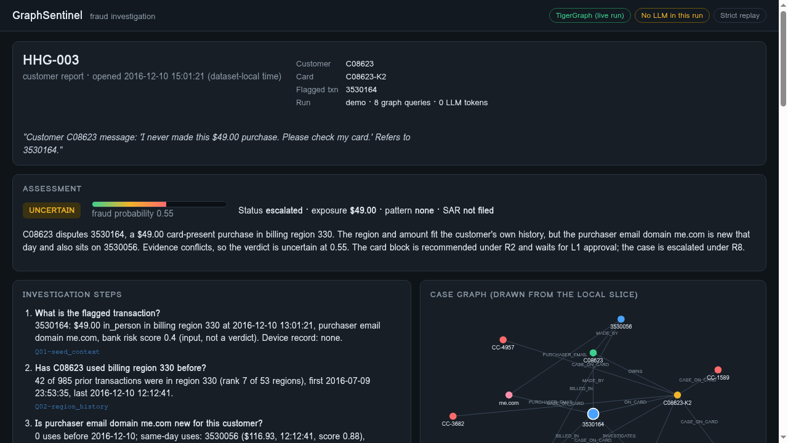
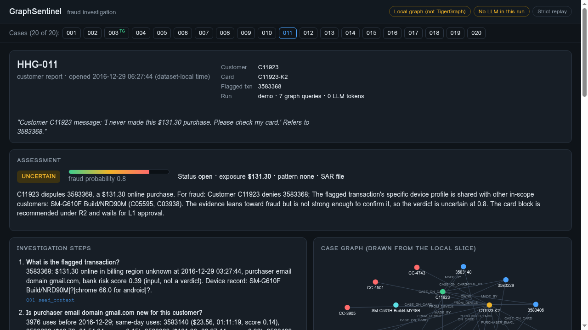

# GraphSentinel

**A fraud investigator that reads a transaction graph, shows its evidence, and hands the hard call to a human.**

GraphSentinel takes a fraud case, asks the graph eight specific questions, weighs what comes back, and writes a case file: a verdict with a probability, the evidence for and against, the next actions and who must approve each one, a SAR decision, and the reason it stopped. Built for the TigerGraph x Hacker House Goa fraud-investigation challenge on the organizer's IEEE-CIS-derived dataset.

- **Live demo (analyst view, all 20 cases):** https://graphsentinel-five.vercel.app
- **TigerGraph live run:** [HHG-003](https://graphsentinel-five.vercel.app/?case=HHG-003) (8 installed GSQL queries on Savanna, 8/8 parity with the local graph)
- **Answer files:** [`cases/HHG-001.json`](cases/HHG-001.json) … [`cases/HHG-020.json`](cases/HHG-020.json)



## Contents

- [Requirement checklist](#requirement-checklist)
- [The HHG-003 story](#the-hhg-003-story)
- [Results on the 20 cases](#results-on-the-20-cases)
- [Evidence](#evidence)
- [Architecture](#architecture)
- [The 8 investigation queries](#the-8-investigation-queries)
- [TigerGraph status (exact)](#tigergraph-status-exact)
- [Run it locally](#run-it-locally)
- [Limits](#limits)
- [Roadmap](#roadmap)
- [Design docs](#design-docs)

## Requirement checklist

Mapped line by line to the [official brief](docs/sources/hackathon-brief.md). **Built** = in this repo and running. **Partial** = some of it is built; the gap is stated. **Planned** = not built yet.

### The agent (brief, "The agent")

| # | Brief requirement | Status | How / gap |
|---|---|---|---|
| 1 | Triggered by a risk score, a customer report, or an analyst | **Built** | All three trigger types in the case pack run through the same pipeline: 11 risk-score, 8 customer-report, 1 analyst-request case. |
| 2 | Evidence from knowledge graph, transaction history, device/identity, account behavior, prior cases | **Built** | 8 graph queries: seed context, region history, email-domain history, amount profile, 48h timeline, device context, historical cases, shared origin. |
| 2 | Evidence from external data sources | **Planned** | No external source is called. Merchant identity and settlement status are not in the data and stay "unknown". |
| 3 | Identify fraud patterns, type of fraud, level of risk | **Partial** | Risk level: a fraud probability per case from visible, weighted factors. Pattern naming: the five documented patterns are not yet matched; every case reports `pattern: none`. |
| 4 | Create and progress a case; record decisions and actions | **Built** | `CREATE_CASE` per policy, case status (`open` / `escalated`), evidence with receipt IDs, and the ordered `tool_calls` record (every graph query and its receipt) in each answer file. |
| 5 | Case memory: retrieve prior cases, use outcomes, update memory | **Partial** | Prior closed cases on the same card/customer are retrieved and weighed (`gs_historical_cases`), and organizer outcome base rates inform the model-alert prior. Similar-case retrieval across customers and writing new outcomes back are not built. |
| 6 | Controlled evidence gathering (customer validation, step-up, analyst info) | **Built** | `evidence_requests` routed through policy. No reply is invented: the record uses one fixed default (no reply within 24 hours). |
| 7 | Recommend next actions | **Built** | Actions from the policy table: `VERIFY_WITH_CUSTOMER`, `MONITOR_CARD`, `BLOCK_CARD`, `MONITOR_CONNECTED_CARDS`, `ESCALATE_TO_ANALYST`, `FILE_REPORT`, `CREATE_CASE`. |
| 8 | Policies, permissions, approvals | **Built** | Rules R1-R10 with `auto` / `L1` / `L2` routes. Money-moving actions such as `BLOCK_CARD` wait for L1 approval; nothing is executed. |
| 9 | Stop when there is enough evidence | **Built** | `stop_reason` in every answer file. |
| 10 | Explain reasoning | **Built** | `case.summary`, evidence with sources and receipt IDs, a policy rule on every action, `what_changed` between initial and final actions. |

### Required components (brief, "What Participants Build With")

| Component | Status | How / gap |
|---|---|---|
| TigerGraph Savanna or Community Edition | **Partial** | Savanna graph `GraphSentinel` holds the HHG-003 case slice; the other 19 cases run on the local in-memory graph with the same queries. Vector storage is not used. |
| GSQL and graph algorithms | **Partial** | 8 installed GSQL queries ([`graph/queries/investigation_queries.gsql`](graph/queries/investigation_queries.gsql)). No library graph algorithms (community detection, PageRank) yet. |
| TigerGraph MCP | **Planned** | Not built. Queries are called over REST. |
| GraphRAG | **Planned** | Not built. No vector search, no policy-document retrieval. |
| User interface | **Built** | Static analyst view ([`apps/web`](apps/web)): case picker for all 20 cases, evidence, uncertainty, investigation steps, case graph, actions with approval routes, SAR, and a backend badge. |
| LLM (optional) | **Planned** | Not in this build. Every run uses 0 LLM tokens and the page says "No LLM in this run". |

### Submission items (brief, "Submissions")

| Item | Status | Where |
|---|---|---|
| Working agent | **Built** | `pnpm case:run <case-id>` |
| GitHub repository | **Built** | this repository |
| One answer file per case, all 20 | **Built** | [`cases/`](cases) |
| - investigation record, evidence, findings, decisions, actions | **Built** | `case`, `evidence_requests`, `tool_calls`, `next_best_actions`, `stop_reason` in each file |
| - case written to the graph | **Planned** | Case write-back stays local: `written_to_graph: false` in every file, and the page says so. |
| - SAR when policy requires it | **Built** | `sar` in each file; 2 of 20 cases file one (HHG-011, HHG-019). |
| - next best action and approval route, before and after requested evidence | **Built** | `next_best_actions.initial`, `.final`, `.what_changed` |
| 3-5 minute demo video | **Planned** | not recorded yet |
| Technical blog post | **Planned** | not published yet |
| Social post tagging @TigerGraphDB | **Planned** | not posted yet |

## The HHG-003 story

Customer C08623 writes in: *"I never made this $49.00 purchase. Please check my card."*

GraphSentinel does not guess. It runs eight graph queries on TigerGraph Savanna and finds:

| Question | What the graph says |
|---|---|
| Is region 330 new for this customer? | No. 42 of 985 prior transactions were there, since July 2016 (rank 7 of 53 regions). |
| Is $49 unusual? | No. 68 prior transactions were within $1 of $49. |
| Is the purchaser email domain new? | **Yes.** `me.com` was never used before that day, and it also sits on a $116.93 purchase earlier that day with a bank risk score of 0.88. |
| Any devices shared with other customers? | No. |
| Prior cases on this card? | 6 closed cases, 5 of them confirmed fraud. |
| Does it connect to other customers? | No shared-origin links in the 48-hour window. |

The evidence conflicts: the place and amount fit the customer, the email domain does not. So the verdict is **uncertain, fraud probability 0.55**. The agent recommends a card block that **waits for L1 analyst approval** and **escalates to an analyst** with the conflict visible. No SAR is filed, and the page says why.

**Why not "out of region, fraud 0.9"?** Region 330 looks unusual only against the single most common region (299, 117 of 986 transactions). Against the customer's full history it is established: see [the region baseline](#hhg-003-region-baseline) below. Calling it out-of-region would be a confident answer built on the wrong baseline.

## Results on the 20 cases

Every case runs through the same pipeline, anchored on the case seed's exact customer, card and transaction IDs. Click a case ID to open it in the analyst view.

| Case | Trigger | Verdict | Fraud p | Status | Final actions | SAR | Graph backend |
|---|---|---|---|---|---|---|---|
| [HHG-001](https://graphsentinel-five.vercel.app/?case=HHG-001) | risk score | uncertain | 0.3 | open | VERIFY_WITH_CUSTOMER, MONITOR_CARD | no | local graph |
| [HHG-002](https://graphsentinel-five.vercel.app/?case=HHG-002) | risk score | uncertain | 0.45 | open | VERIFY_WITH_CUSTOMER, MONITOR_CARD | no | local graph |
| [HHG-003](https://graphsentinel-five.vercel.app/?case=HHG-003) | customer report | uncertain | 0.55 | escalated | CREATE_CASE, MONITOR_CARD, BLOCK_CARD, ESCALATE_TO_ANALYST | no | TigerGraph (live) |
| [HHG-004](https://graphsentinel-five.vercel.app/?case=HHG-004) | customer report | uncertain | 0.65 | open | CREATE_CASE, MONITOR_CARD, BLOCK_CARD | no | local graph |
| [HHG-005](https://graphsentinel-five.vercel.app/?case=HHG-005) | risk score | uncertain | 0.35 | open | VERIFY_WITH_CUSTOMER, MONITOR_CARD | no | local graph |
| [HHG-006](https://graphsentinel-five.vercel.app/?case=HHG-006) | customer report | uncertain | 0.55 | escalated | CREATE_CASE, MONITOR_CARD, BLOCK_CARD, ESCALATE_TO_ANALYST | no | local graph |
| [HHG-007](https://graphsentinel-five.vercel.app/?case=HHG-007) | risk score | uncertain | 0.35 | open | VERIFY_WITH_CUSTOMER, MONITOR_CARD | no | local graph |
| [HHG-008](https://graphsentinel-five.vercel.app/?case=HHG-008) | customer report | uncertain | 0.65 | open | CREATE_CASE, MONITOR_CARD, BLOCK_CARD | no | local graph |
| [HHG-009](https://graphsentinel-five.vercel.app/?case=HHG-009) | customer report | uncertain | 0.65 | open | CREATE_CASE, MONITOR_CARD, BLOCK_CARD | no | local graph |
| [HHG-010](https://graphsentinel-five.vercel.app/?case=HHG-010) | risk score | uncertain | 0.35 | escalated | VERIFY_WITH_CUSTOMER, MONITOR_CARD, ESCALATE_TO_ANALYST | no | local graph |
| [HHG-011](https://graphsentinel-five.vercel.app/?case=HHG-011) | customer report | uncertain | 0.8 | open | CREATE_CASE, MONITOR_CARD, BLOCK_CARD, MONITOR_CONNECTED_CARDS, FILE_REPORT | yes | local graph |
| [HHG-012](https://graphsentinel-five.vercel.app/?case=HHG-012) | risk score | uncertain | 0.3 | open | VERIFY_WITH_CUSTOMER, MONITOR_CARD | no | local graph |
| [HHG-013](https://graphsentinel-five.vercel.app/?case=HHG-013) | risk score | uncertain | 0.45 | open | VERIFY_WITH_CUSTOMER, MONITOR_CARD | no | local graph |
| [HHG-014](https://graphsentinel-five.vercel.app/?case=HHG-014) | analyst request | uncertain | 0.4 | open | MONITOR_CARD | no | local graph |
| [HHG-015](https://graphsentinel-five.vercel.app/?case=HHG-015) | risk score | uncertain | 0.45 | escalated | VERIFY_WITH_CUSTOMER, MONITOR_CARD, ESCALATE_TO_ANALYST | no | local graph |
| [HHG-016](https://graphsentinel-five.vercel.app/?case=HHG-016) | customer report | uncertain | 0.65 | open | CREATE_CASE, MONITOR_CARD, BLOCK_CARD | no | local graph |
| [HHG-017](https://graphsentinel-five.vercel.app/?case=HHG-017) | risk score | uncertain | 0.45 | open | VERIFY_WITH_CUSTOMER, MONITOR_CARD | no | local graph |
| [HHG-018](https://graphsentinel-five.vercel.app/?case=HHG-018) | customer report | uncertain | 0.5 | escalated | CREATE_CASE, MONITOR_CARD, BLOCK_CARD, ESCALATE_TO_ANALYST | no | local graph |
| [HHG-019](https://graphsentinel-five.vercel.app/?case=HHG-019) | risk score | uncertain | 0.6 | escalated | CREATE_CASE, MONITOR_CARD, MONITOR_CONNECTED_CARDS, ESCALATE_TO_ANALYST, FILE_REPORT | yes | local graph |
| [HHG-020](https://graphsentinel-five.vercel.app/?case=HHG-020) | risk score | uncertain | 0.35 | open | VERIFY_WITH_CUSTOMER, MONITOR_CARD | no | local graph |
**All 20 verdicts are "uncertain", on purpose.** The organizer history shows why a firm call is hard from graph evidence alone:

- **Model risk-score alerts lean legitimate.** 0 of 900 model-scored closed cases in the organizer history were confirmed fraud. These cases get p 0.30-0.60. Ten of the eleven ask the customer to confirm (`VERIFY_WITH_CUSTOMER`, R3) instead of blocking; HHG-019 (p 0.60, with links to other customers) opens a case, escalates and files a SAR.
- **Customer reports lean fraud.** 4,656 of 4,656 cardholder-reported closed cases were confirmed fraud. These cases get p 0.50-0.80, open a case, and recommend a card block that waits for L1 approval.
- **Escalation.** When evidence conflicts (6 cases), the case is escalated to an analyst under R8 with the conflict written into the summary.
- **SAR.** Filed for 2 cases (HHG-011, HHG-019) where policy requires it; the other 18 record why not.

The agent will not turn a lean into a verdict it cannot defend. The customer reply that would settle most cases is not in the data, and the agent does not invent one.



## Evidence

| Claim | Evidence |
|---|---|
| TigerGraph and local graph agree | HHG-003 committed run: 8/8 installed GSQL query results match the local graph ([`reports/runs/demo/HHG-003.run.json`](reports/runs/demo/HHG-003.run.json)). The run fails loudly on any mismatch. |
| Tests | `pnpm test:unit`: 11 test files, 75 tests passing (local graph, investigator, policy boundaries and conflicts, answer contract, exporter, TigerGraph replay and parity). |
| 20 answer files | [`cases/`](cases), one per case pack entry, all valid against the answer schema. |
| No LLM | Every answer file reports 0 LLM tokens. |
| Region baseline for HHG-003 | See below. |

### HHG-003 region baseline

From the HHG-003 case slice (986 transactions, 981 on the flagged card):

- Region 330 has **42 prior transactions**, first seen July 2016. It is rank 7 of the customer's regions: established, not new.
- The customer used **54 distinct billing regions** in total.
- Week by week, the customer uses **14-25 distinct regions**. The last week before the case had 25 regions over 54 transactions, and 330 appeared 8 times, its highest single-week count.

So wide region spread is normal for this card, and region 330 is part of that normal. The disputed charge's region does not support fraud; the new email domain does.

## Architecture

```
organizer CSVs ──> case slice (one per case) ──> graph
                                             │  8 investigation queries
                                             v
                         investigator (deterministic code, no LLM)
                                             │  evidence + receipts
                                             v
                  policy rules ──> verdict, probability, next actions, approval routes
                                             │
                                             v
                     case file (cases/HHG-0xx.json) ──> analyst view (apps/web)
```

The graph can be either:

- **TigerGraph Savanna** (graph `GraphSentinel`): the HHG-003 slice is loaded there, and the 8 queries are installed GSQL queries called over REST. Use `GRAPH_BACKEND=tigergraph`.
- **Local in-memory graph**: the same queries in TypeScript over the same slice. This is the default and the fallback, and it produced the other 19 case runs.

Every query result is saved as a receipt, and every claim in the case file points to a receipt ID.

Each case slice is cut from the organizer CSVs around the seed's customer, card and flagged transaction (full customer history plus a 48-hour neighborhood of other customers), so every case runs on only the data it needs.

The web app is static: [`scripts/build-web-index.ts`](scripts/build-web-index.ts) writes `apps/web/data/index.json` from the saved runs, and the page replays them. The browser never calls TigerGraph.

## The 8 investigation queries

Installed on Savanna from [`graph/queries/investigation_queries.gsql`](graph/queries/investigation_queries.gsql):

| # | Query | Question it answers |
|---|---|---|
| 1 | `gs_seed_context` | What is the flagged transaction (amount, region, email domain, device, risk score)? |
| 2 | `gs_region_history` | Has this customer used this billing region before, and since when? |
| 3 | `gs_email_domain_history` | Is this purchaser email domain new, and where else does it appear that day? |
| 4 | `gs_amount_profile` | Is this amount typical for the customer? |
| 5 | `gs_customer_timeline` | What happened on the account in the 48 hours before the case? |
| 6 | `gs_device_context` | Do the customer's devices link to other customers? |
| 7 | `gs_historical_cases` | What prior cases exist on this card and customer? |
| 8 | `gs_shared_origin` | Does this transaction connect to other customers or cards? |

## TigerGraph status (exact)

What is true today:

- **Live on TigerGraph Savanna:** the HHG-003 case data is loaded into graph `GraphSentinel`, and all 8 queries above are installed and valid there.
- **`GRAPH_BACKEND=tigergraph`:** `pnpm case:run` runs all 8 queries on Savanna over REST, then re-runs each one on the local graph and compares. The run fails if any result differs. The committed run matches 8/8.
- **The public demo page** shows that saved TigerGraph run. Your browser does not call TigerGraph; the badge at the top of the page says which backend produced the run.
- **Still local, even in TigerGraph mode:** the case subgraph drawing, prior-fraud regions, and the case write-back (`written_to_graph` is `false`). A few fields are not stored in TigerGraph: card fields, `dist1`, and two closed-case fields.
- **Default:** without `GRAPH_BACKEND=tigergraph`, everything runs on the local graph.
- **The other 19 cases** ran on the local graph. Their pages say "Local graph (not TigerGraph)" at the top, and the case picker marks only HHG-003 with `TG`.

What is **not** in this build: no LLM (every run uses 0 tokens; the page shows a "No LLM in this run" badge), no MCP server, no GraphRAG or vector search, no case write-back to TigerGraph. These are on the [roadmap](#roadmap), not built.

## Run it locally

```bash
pnpm install

# Investigate any case on the local graph (uses the committed slices in data/slices/)
RUN_ID=demo pnpm case:run HHG-007

# Rebuild the case index for the web app after re-running cases
npx tsx scripts/build-web-index.ts

# Or investigate on TigerGraph Savanna (needs your own Savanna host and database secret)
TG_HOST=https://<your-savanna-host> TG_SECRET=<database-secret> \
  GRAPH_BACKEND=tigergraph RUN_ID=demo pnpm case:run HHG-003

# Open the analyst view at http://localhost:8765/
pnpm web
```

To rebuild the slice from the organizer CSVs (about 700 MB, from the organizer Drive folder):

```bash
pnpm case:slice /path/to/organizer-csvs HHG-007 data/slices/HHG-007.json
```

Tests:

```bash
pnpm test:unit   # 11 test files, 75 tests passing
pnpm typecheck
```

The TigerGraph tests run offline against saved responses.

## Limits

- 1 of 20 cases ran on TigerGraph; 19 ran on the local graph with the same queries.
- No fraud pattern is named yet; every case reports `pattern: none`.
- The K1/K2/K3 card-suffix rule is not documented by the organizers, so only the flagged transaction and closed-case transactions are tied to a card.
- Merchant identity and settlement status are not in the data and stay unknown.
- Customer replies use one fixed default (no reply within 24 hours), never chosen per case.
- The probability weights are a visible rule, not a trained model.
- The case record is not written back to TigerGraph (`written_to_graph: false`).

## Roadmap

Planned, **not built**:

- **TigerGraph MCP:** call the installed queries through the official [tigergraph-mcp](https://github.com/tigergraph/tigergraph-mcp) server instead of direct REST.
- **LLM narrative:** an LLM writes the plain-language case summary from the computed evidence receipts; code keeps the verdict and actions.
- **GraphRAG:** retrieve policy sections and similar closed cases as grounded context.
- **Case write-back:** write each finished case to TigerGraph so later investigations can reach it.
- **All 20 cases on TigerGraph**, pattern matching for the five documented patterns, and graph algorithms (community detection) for ring discovery.

## Design docs

The original build plan is kept for reference. It describes a larger system than what is built here.

| File | Use |
|---|---|
| [Build plan and design](docs/superpowers/specs/2026-09-22-fraud-investigation-design.md) | Full target architecture, policy and output contract. |
| [Phased task list](docs/superpowers/plans/2026-09-22-fraud-investigation-implementation-plan.md) | The planned phases and tasks. |
| [Coding-agent handoff](HANDOFF.md) | Execution prompt and milestone checkpoints. |
| [Source register](docs/references/SOURCES.md) | Organizer sources and technology references. |
| [Original brief](docs/sources/hackathon-brief.md) | The challenge document, unmodified. |
| [Dataset README](docs/sources/dataset-readme.md) | Organizer dataset README, policy and answer format. |
